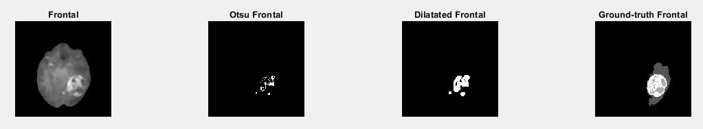
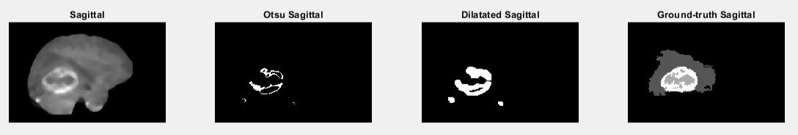
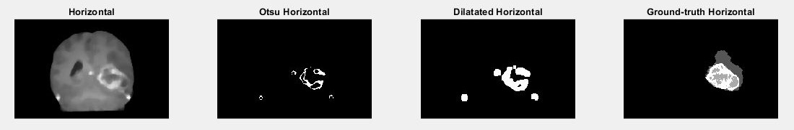

# 🧠 Brain tumor segmentation with MATLAB - BraTS challenge
Brain tumors, if detected early, can significantly increase the chances of successful treatment. However, manual interpretation of MRI images is time-consuming and prone to variability among radiologists. 

By applying Image Processing algorithms, this work aims to offer an additional tool to doctors for the tumor detection process. This project also provides a solution for the Brain Tumor Segmentation (BraTS) Challenge hosted by the [medical decathlon](http://medicaldecathlon.com/).

The methodology followed in this work is based on the procedure described in [this document](./static/Brain-Tumour-Extraction-from-MRI-Images-Using-MATLAB.pdf).


## 📚 Main concepts applied in this work
- Noise reduction using median filtering
- Otsu Thresholding method
- Morphological operations, dilation, to refine the segmented region  

For in-detail description about operations applied, read the [technical report](./static/technical_report.pdf).

## Example
In these images it's possible to appreciate the result of Otsu thresholding and dilation application on original image, and compare the obtained result with the ground-truth.  
**Frontal view**  
<div align="center">
  
</div>

**Sagittal view**    
<div align="center">
  
</div>

**Horizontal view**  
<div align="center">
  
</div>

# 🚀 Usage

1. Clone the repository:
```bash
git clone https://github.com/GiuseppeFarano/brain-tumor-segmentation.git
 ```
2. Open the project in MATLAB

3. Run the MATLAB script "brain_tumor_detection.m" 

## 🪪 License

This project is distributed under the Apache 2.0 License

---

## 👨‍💻 Authors

- Giuseppe Farano

---

This project was developed for educational purposes as part of a university course. It is not intended for production use.
